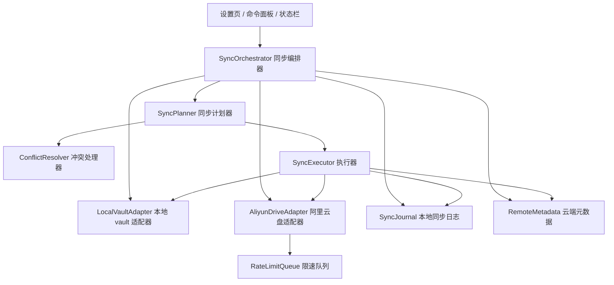

# Obsidian 阿里云盘同步插件设计

## 目标

实现一个 Obsidian 社区插件，把用户指定的 Obsidian vault，或 vault 中指定的目录，自动同步到云端阿里云盘里的某个文件夹。

这里的“阿里云文件夹”不是本机同步盘目录，也不是本地文件夹，而是用户阿里云盘账号中的云端文件夹。这个云端文件夹作为所有设备共同访问的同步中心：

1. 设备 A 修改 Obsidian 笔记后，插件自动或手动把变更上传到云端阿里云盘文件夹。
2. 设备 B 安装同一个插件、登录同一个阿里云盘账号、选择同一个云端同步文件夹后，插件会在启动、定时轮询或本地事件触发时检查云端是否有更新。
3. 如果检测到云端内容比本地新，设备 B 自动拉取更新并写入本地 vault。
4. 如果两台设备都改了同一个文件，插件进入冲突处理流程，默认保留两边内容，避免静默覆盖。

第一优先级是“阿里云盘 Aliyun Drive / Aliyun Netdisk 云端文件夹同步”。阿里云 OSS 可以作为未来的高级后端，但它是 Bucket/Prefix 对象存储，不等同于普通阿里云盘文件夹体验。

## 参考方案调研结论

### Sync Vault

Sync Vault 的方向接近“Obsidian 云盘同步平台”。它支持阿里云盘、百度网盘、OneDrive、WebDAV、COS、S3 等，并包含加密、云端文件浏览、P2P 协作、CRDT、MCP 等更平台化的功能。

它对本项目最有价值的地方不是完整功能，而是架构拆分：

- 云盘服务层把上传、下载、文件信息、文件管理拆成独立接口。
- 阿里云盘适配层处理 OpenList refresh_token 续期、获取 drive 信息、按路径查文件、分页列表、上传、下载、删除、移动。
- 对不同接口做限速队列，避免被阿里云盘接口限流。
- 使用远端元数据和本地状态判断文件是否需要上传或下载。

但 Sync Vault 的产品范围比本项目大很多。MVP 阶段不建议引入 P2P、CRDT、VFS、MCP 这些能力。

### Remotely Save

Remotely Save 是更成熟的通用云同步插件。它对本项目最有参考价值的是同步算法：

- 同时比较本地当前状态、远端当前状态、上一次成功同步记录。
- 用上一轮同步记录判断“新增、修改、删除、未变化”。
- 把删除信息作为一等状态处理，而不是简单看文件是否存在。
- 对 markdown 文件可做三方合并。
- 对无法自动合并的文件使用冲突副本，避免数据丢失。

Remotely Save 的 S3/OSS 路线也有价值，但更适合作为“阿里云 OSS 高级后端”，不是本项目的主线。

### 最优路线判断

如果你的目标是“同步到我阿里云盘里的某个云端文件夹，并让另一台设备自动拉取”，最优方案是：

1. 主后端使用阿里云盘开放平台 API。
2. 当前实现使用 OpenList refresh_token 模式取得访问令牌，避免个人开发者无法注册应用导致 OAuth 直连不可用。
3. 云端阿里云盘文件夹作为多设备同步中心。
4. 每台设备保留本地同步日志，云端保留轻量同步元数据。
5. 使用三方同步算法，而不是简单“谁新覆盖谁”。
6. 自动同步采用启动检查、定时轮询、保存后 debounce 触发。阿里云盘开放 API 一般不能给 Obsidian 插件直接推送变更，所以“自动检测”应设计为可靠轮询，而不是依赖实时通知。

## 产品范围

### MVP 必须包含

1. 阿里云盘 Open refresh_token 导入和续期。
2. 选择或输入云端阿里云盘同步文件夹，例如 `/Apps/ObsidianSync/<vault-id>`。
3. 手动同步命令。
4. 启动后自动检查云端更新。
5. 定时自动同步。
6. 本地保存后延迟同步。
7. 多设备共享同一个云端同步文件夹。
8. include/exclude 规则。
9. `.obsidian` 配置目录同步开关，默认关闭。
10. 本地同步日志。
11. 云端同步元数据文件。
12. 删除保护。
13. 冲突处理。

### MVP 不做

- 实时协同编辑。
- CRDT。
- P2P。
- MCP 云端搜索。
- 网盘文件浏览器。
- 多云盘平台化。
- OSS 后端。

这些能力以后可以做，但第一版应先保证同步可靠。

## 技术选型

建议使用：

- TypeScript。
- Obsidian sample plugin 项目结构。
- esbuild。
- Obsidian `requestUrl` 做网络请求。
- `localforage` 存 IndexedDB 同步日志。
- `node-diff3` 或等价 diff3 库做 markdown 三方合并。
- `p-queue` 或自研轻量队列做接口限速。
- Web Crypto API 做可选加密。

暂不建议：

- MVP 阶段依赖重型自建后端。当前只允许配置 OpenList APIPages 续期接口，用于保护 OAuth 应用密钥并刷新 access token。
- 把阿里云 OSS 当主方案。OSS 需要 Bucket、Endpoint、CORS、AccessKey 或 STS，用户心智和“阿里云盘文件夹”不同。
- 直接复制参考项目代码。可以学习结构和算法，但要重新实现，避免许可证和维护问题。

## 总体架构



## 核心模块

### `src/main.ts`

- 插件生命周期。
- 注册命令。
- 注册状态栏。
- 注册设置页。
- 注册 vault 文件事件。
- 启动自动同步调度器。

### `src/settings.ts`

- 插件设置结构。
- 设置迁移。
- 阿里云盘授权状态。
- 同步范围。
- 自动同步策略。
- 冲突策略。
- 删除保护策略。

### `src/local/LocalVaultAdapter.ts`

负责读取和写入本地 Obsidian vault。

- 遍历整个 vault 或指定目录。
- 读取普通文件。
- 通过 `vault.adapter` 读取 `.obsidian` 等隐藏路径。
- 统一路径格式为 vault 相对路径。
- 处理 ignore 规则。
- 写入下载文件时避免触发重复同步。

### `src/remote/RemoteAdapter.ts`

远端云盘统一接口。

```ts
export interface RemoteAdapter {
  kind: "aliyun-drive" | "aliyun-oss";
  authenticate(): Promise<AuthState>;
  refreshAuthIfNeeded(): Promise<void>;
  stat(path: string): Promise<RemoteEntry | null>;
  list(path: string): Promise<RemoteEntry[]>;
  read(path: string): Promise<ArrayBuffer>;
  write(path: string, data: ArrayBuffer, meta: WriteMeta): Promise<RemoteEntry>;
  mkdir(path: string): Promise<RemoteEntry>;
  delete(path: string): Promise<void>;
  move(from: string, to: string): Promise<void>;
  checkConnectivity(): Promise<ConnectivityResult>;
}
```

第一版只实现 `aliyun-drive`。

### `src/remote/aliyun-drive/*`

负责阿里云盘开放平台 API。

- OpenList refresh_token 续期。
- token 换取和刷新。
- 获取用户 drive 信息。
- 解析云端同步根文件夹。
- 按文件夹分页列出文件。
- 递归创建文件夹。
- 创建上传 URL。
- 上传分片。
- 完成上传。
- 获取下载 URL。
- range 下载大文件。
- 删除、移动、重命名文件。
- 接口限速、重试、退避。

### `src/sync/SyncJournal.ts`

本地同步日志，存储在 IndexedDB。

每个设备都要有自己的同步日志。它记录“这台设备上一次成功同步时，本地和云端分别是什么状态”。

建议记录：

- path。
- local mtime、size、hash。
- remote file id、path、mtime、size、hash。
- 小型 markdown 文件的 base content。
- 删除 tombstone。
- 最后成功同步时间。
- device id。
- plugin version。

### `src/sync/RemoteMetadata.ts`

云端元数据文件，保存在阿里云盘同步根目录，例如：

```text
<远端同步根目录>/.obsidian-aliyun-sync/meta.json
```

它的作用是帮助多设备协调，而不是替代真实文件列表。

建议包含：

- vault id。
- 插件协议版本。
- 参与过同步的 device ids。
- 最近一次同步摘要。
- 远端删除 tombstones。
- 可选轻量锁。

注意：不能把 token、密码、密钥写进远端元数据。

### `src/sync/SyncPlanner.ts`

同步计划器。

输入：

- 当前本地文件树。
- 当前云端阿里云盘文件树。
- 本地上一轮成功同步日志。
- 云端元数据。

输出：

- 上传。
- 下载。
- 创建目录。
- 删除本地。
- 删除远端。
- markdown 合并。
- 生成冲突副本。
- 跳过。

### `src/sync/ConflictResolver.ts`

冲突处理器。

默认策略：

- markdown 文件在有 base content 时做三方合并。
- markdown 文件没有 base content 时做保守双向合并并留下冲突标记。
- 二进制文件和大文件生成冲突副本。
- 永远不要静默覆盖两边都修改过的文件。

### `src/sync/SyncExecutor.ts`

执行同步计划。

执行顺序：

1. 创建本地和远端目录。
2. 上传文件。
3. 下载文件。
4. 处理 markdown 合并。
5. 处理冲突副本。
6. 执行删除。
7. 全部成功后更新本地日志和云端元数据。

删除必须最后执行，并且必须通过删除保护。

## 数据模型

```ts
export interface SyncEntity {
  path: string;
  type: "file" | "folder";
  size: number;
  mtime: number;
  hash?: string;
  remoteId?: string;
  etag?: string;
}

export interface SyncBaseRecord {
  path: string;
  local?: SyncEntity;
  remote?: SyncEntity;
  baseContentKey?: string;
  deletedLocalAt?: number;
  deletedRemoteAt?: number;
  lastSuccessAt: number;
  deviceId: string;
}

export interface SyncOperation {
  path: string;
  kind:
    | "upload"
    | "download"
    | "delete-local"
    | "delete-remote"
    | "mkdir-local"
    | "mkdir-remote"
    | "merge-markdown"
    | "duplicate-conflict"
    | "skip";
  reason: string;
  destructive: boolean;
}
```

## 同步算法

必须使用三方同步算法，而不是简单比较本地和云端谁更新。

对每个路径，读取：

- `L`: 当前本地状态。
- `R`: 当前云端阿里云盘状态。
- `B`: 这台设备上一轮成功同步时的基准状态。

然后判断：

- 本地是否相对 B 变化。
- 云端是否相对 B 变化。
- 本地是否新增。
- 云端是否新增。
- 本地是否删除。
- 云端是否删除。

决策规则：

| 本地状态 | 云端状态 | 操作 |
| --- | --- | --- |
| 未变化 | 已修改 | 下载云端到本地 |
| 已修改 | 未变化 | 上传本地到云端 |
| 已删除 | 未变化 | 删除云端，前提是删除同步已开启 |
| 未变化 | 已删除 | 删除本地，前提是删除同步已开启 |
| 已修改 | 已修改 | 进入冲突处理 |
| 两边新增同一路径 | 内容相同则标记已同步，否则生成冲突副本 |
| 一边新增一边不存在 | 上传或下载 |

为什么不能只看 mtime：

- 阿里云盘上传后返回的时间可能和本地文件时间不完全一致。
- Windows、移动端、云端 API 的时间精度可能不同。
- 删除状态无法靠 mtime 判断。
- 多设备并发修改时，“较新”不一定代表应该覆盖。

## 多设备自动同步机制

自动同步不是实时协同，而是可靠的自动检测和自动拉取。

每台设备都运行同样的流程：

1. 插件启动后延迟几秒，检查云端同步文件夹。
2. 定时轮询云端元数据和文件列表。
3. 本地文件保存后，延迟一段时间触发上传检查。
4. 发现云端有新版本后，自动生成同步计划。
5. 如果计划没有冲突和危险删除，自动执行下载或上传。
6. 如果有冲突，生成冲突副本或合并，并通知用户。
7. 如果有大量删除，停止自动执行，等待用户确认。

推荐默认值：

- 启动后 10 秒检查一次。
- 定时同步默认 5 到 10 分钟。
- 保存后 debounce 10 到 30 秒。
- 移动端可使用更长间隔，减少耗电。

需要注意：

- Obsidian 插件一般无法在应用关闭时后台运行。
- 如果设备 B 没打开 Obsidian，它不会立即拉取。
- 设备 B 下次打开 Obsidian，或定时轮询到云端更新时，会自动拉取。

## 冲突策略

默认使用保守策略：

- 不静默覆盖。
- 能自动合并 markdown 就合并。
- 不能合并就保留两份。
- 冲突结果写入同步报告。

冲突副本命名：

```text
原文件: note.md
冲突副本: note.conflict.<device-name>.<yyyyMMdd-HHmmss>.md
```

可选策略：

- 保留两边。
- 优先本地。
- 优先云端。
- markdown 智能合并。
- 保留较新版本。

`保留较新版本` 不建议作为默认值，因为云端时间戳并不总是可信。

## 删除保护

删除是同步里最危险的动作，必须单独保护。

建议规则：

- 默认开启删除同步，但设置安全阈值。
- 如果一次同步计划删除超过 N 个文件，停止执行。
- 如果删除比例超过整个 vault 的某个百分比，停止执行。
- 如果云端根目录突然为空，停止执行。
- 删除操作最后执行。
- 删除成功前不更新同步日志。

## 阿里云盘适配器设计

### 授权

当前使用 OpenList refresh_token 模式。

流程：

1. 用户在 OpenList Token 获取工具中选择阿里云盘 OAuth2 扫码登录。
2. 用户勾选使用 OpenList 提供的参数，扫码授权个人阿里云盘。
3. 工具返回 `Refresh Token`。
4. 用户把 `Refresh Token` 粘贴到插件设置页。
5. 插件调用配置的 OpenList `/alicloud/renewapi` 续期接口换取 `access_token`。
6. 后续 token 过期前自动续期。

保留 OAuth 直连代码只作为兼容兜底；当前用户主路径不依赖个人开发者 Client ID。

### 云端同步根目录

用户选择或输入一个阿里云盘云端路径，例如：

```text
/Apps/ObsidianSync/MyVault
```

插件启动时：

1. 获取用户 drive id。
2. 按路径解析同步根目录。
3. 如果不存在，询问是否创建。
4. 后续所有读写都限制在这个根目录内。

### 上传

上传流程：

1. 读取本地文件 ArrayBuffer。
2. 必要时加密。
3. 调用阿里云盘 create file API 获取上传地址。
4. 分片上传。
5. 调用 complete API。
6. 获取上传后的 file id、mtime、size。
7. 成功后更新同步日志。

### 下载

下载流程：

1. 根据云端 path 或 file id 获取文件信息。
2. 获取临时下载 URL。
3. 大文件按 range 分段下载。
4. 必要时解密。
5. 写入本地 vault。
6. 写入时临时屏蔽本地文件事件，避免重复触发同步。

### 限速和重试

需要按接口类型做队列：

- list。
- get by path。
- get download url。
- upload。
- download。
- delete/move/rename。

遇到：

- 429: 退避重试。
- 403: 下载 URL 可能过期，刷新 URL 后重试。
- 5xx: 有限重试。
- 网络错误: 标记本轮同步失败，不更新日志。

## 阿里云 OSS 作为未来后端

OSS 可作为后续高级选项，不作为 MVP 主线。

优点：

- 对象存储很适合同步算法。
- S3 兼容生态成熟。
- Bucket + Prefix 可直接映射到远端路径。
- 可以启用 Bucket 版本控制。

缺点：

- 用户需要创建 Bucket。
- 用户需要配置 CORS。
- 浏览器或 Obsidian 插件内长期保存 AccessKey 有风险。
- 官方更推荐浏览器端使用 STS 临时凭证。
- OSS 的“文件夹”不是阿里云盘用户看到的普通网盘文件夹。

## 设置项

第一版建议设置：

- 阿里云盘登录状态。
- 云端同步根目录。
- 同步范围：
  - 整个 vault。
  - 指定目录。
  - ignore patterns。
- 是否同步 `.obsidian`。
- 自动同步：
  - 启动时检查。
  - 定时检查。
  - 保存后同步。
- 冲突策略：
  - 保守模式。
  - markdown 自动合并。
  - 始终保留两边。
- 删除保护：
  - 最大删除数量。
  - 最大删除比例。
  - 大量删除前要求确认。
- 可选加密。

## 安全和隐私

- 只申请必要的阿里云盘读写权限。
- token 只保存在本地插件数据中。
- 不把 token、授权码、密码、密钥写入日志。
- 不把密钥写入云端元数据。
- 提供退出登录和清除授权信息功能。
- 如果实现加密，必须提醒用户：密码丢失后云端内容不可恢复。
- 其他 Obsidian 插件理论上可能读取本地插件配置，因此设置页要明确提示本地 token 存储风险。

## 失败场景

需要显式处理：

- OpenList 续期接口不可用。
- refresh_token 无效、被撤销或触发限流。
- token 过期且续期失败。
- 云端同步根目录不存在。
- 用户切换了云端同步目录。
- 云端元数据损坏。
- 阿里云盘限流。
- 临时下载 URL 过期。
- 大文件上传中断。
- 本地写入失败。
- 两台设备同时修改同一文件。
- 远端或本地出现大量删除。

## 测试矩阵

### 单元测试

- 路径归一化。
- ignore 规则。
- 同步计划决策表。
- 删除保护阈值。
- 冲突文件名生成。
- markdown 三方合并。
- 云端元数据序列化。
- 队列限速和重试。

### Mock 集成测试

- 本地首次同步到空云端。
- 云端首次同步到空本地。
- 设备 A 上传后，设备 B 自动检测并下载。
- 设备 A 删除后，设备 B 自动检测删除。
- 两台设备同时修改同一 markdown。
- 两台设备同时修改同一二进制文件。
- 上传中断不更新同步日志。
- token 过期后自动续期。
- 大量删除触发保护。

### 真实手工测试

- 真实阿里云盘登录。
- 选择云端同步文件夹。
- 两台桌面设备同步。
- 桌面和移动端同步。
- `.obsidian` 配置目录同步开关。
- 大附件上传和下载。
- 网络断开后恢复同步。

## 实现顺序

1. 从 Obsidian sample plugin 搭建基础项目。
2. 实现设置页、命令、状态栏。
3. 实现本地 vault walker 和 ignore 规则。
4. 实现本地 SyncJournal。
5. 用 MockRemoteAdapter 写完整同步计划器测试。
6. 实现冲突处理器。
7. 实现同步执行器。
8. 实现阿里云盘 OpenList refresh_token 续期。
9. 实现云端同步根目录解析和创建。
10. 实现阿里云盘 list/upload/download/delete/move。
11. 接入手动同步。
12. 接入启动检查、定时轮询、保存后同步。
13. 接入删除保护和同步报告。
14. 做真实阿里云盘双设备测试。
15. 再考虑加密和 OSS 后端。

## 工程合同

目标：

- 做一个可靠的 Obsidian 阿里云盘云端文件夹同步插件。用户在多台设备上安装同一插件并选择同一个阿里云盘云端文件夹后，插件能自动检测云端更新并拉取，同时能上传本地变更。

范围：

- Obsidian 插件架构。
- 阿里云盘 OpenList refresh_token 续期。
- 阿里云盘文件 API 适配。
- 本地 vault 扫描。
- 三方同步计划器。
- 冲突处理器。
- 本地同步日志。
- 云端同步元数据。
- 自动同步调度。
- 删除保护。
- 测试方案。

非目标：

- 实时协作。
- CRDT。
- P2P。
- MCP。
- 云端文件浏览器。
- 多云盘平台。
- 首版 OSS 后端。

关键架构：

- `SyncOrchestrator` 负责编排。
- `LocalVaultAdapter` 读取本地 vault。
- `AliyunDriveAdapter` 读取云端阿里云盘文件夹。
- `SyncPlanner` 基于本地、云端、上一轮同步基准生成计划。
- `ConflictResolver` 处理冲突。
- `SyncExecutor` 执行计划。
- `SyncJournal` 记录本设备同步基准。
- `RemoteMetadata` 辅助多设备协作。

关键风险：

- 数据丢失风险：用三方同步、删除保护、冲突副本规避。
- 时间戳漂移：不依赖 mtime 单点判断。
- 阿里云盘限流：接口队列和退避重试。
- 多设备并发：用同步日志和云端元数据判断冲突。
- 凭证泄漏：不写日志，不写云端元数据，设置页明确提示本地存储风险。

下一步：

- 先实现插件骨架、本地 vault walker、SyncJournal、MockRemoteAdapter 和 SyncPlanner 测试。等同步算法稳定后，再接真实阿里云盘 OpenList refresh_token 续期和文件 API。
